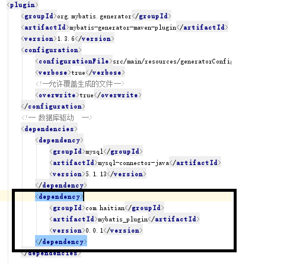

## Feature

### Combine regenerated xml mapper file with existing xml mapper file which you may have modified.


The left is the existing file,you add "batchInsert" and delete "insertSelective" and modify other nodes base on generated xml file.

The right is the combined file,which add insertSelective and keep you the section you add and already exist not be override.

Which means this can only add deleted nodes,not modify the current.

## Usage

- 1.download the jar in release,add it to your lib.
- 2.config maven plugin.
 
  
  

- 3.config generatorConfig.xml


```
<context id="MBG" targetRuntime="MyBatis3" defaultModelType="conditional">
        <plugin type="com.haitian.plugins.CombineXmlPlugin" />
```

